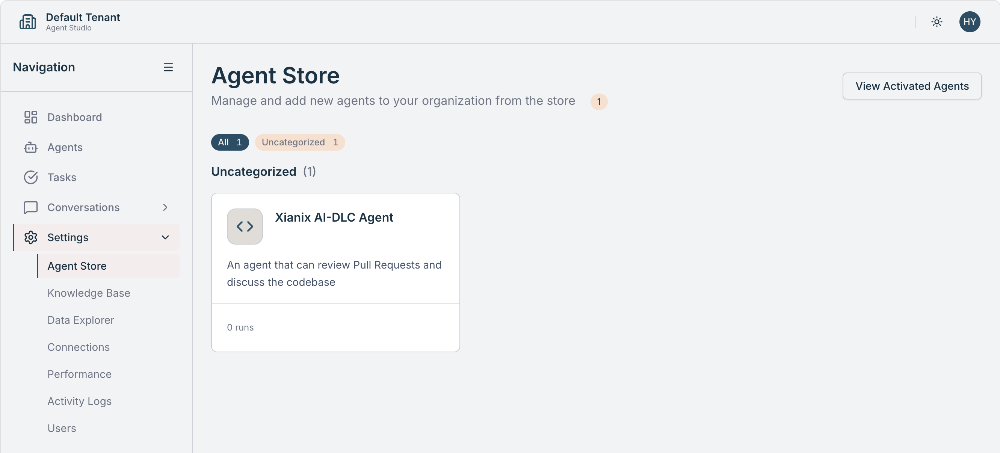
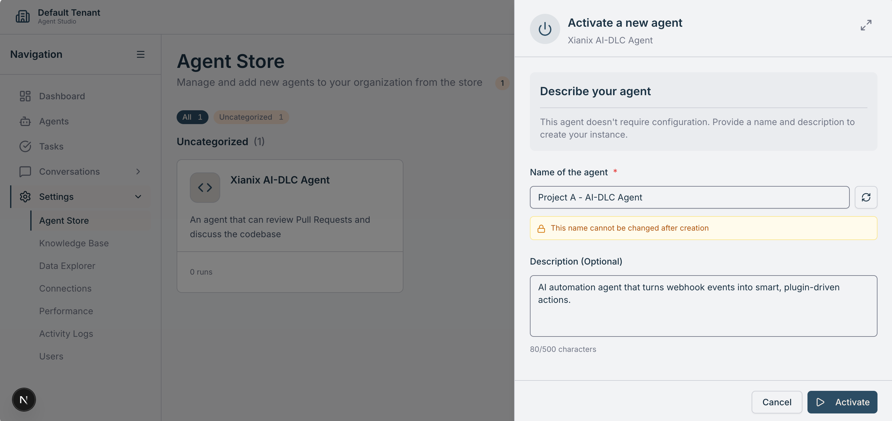
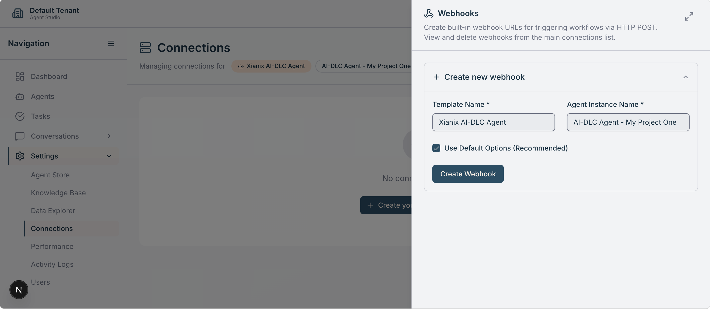

This guide takes you from zero to a working AI-DLC agent — such as automated PR review — on your repository in just a few steps. It assumes you already have a Xianix Agent deployed on a Xians instance. If you're on a 99x team using [Agentri](https://agentri.ai/), an agent is already available for you.

:::tip[Before you begin]
Make sure you have everything listed in the [Prerequisites](./prerequisites) page ready to go.
:::

## 1. Activate the agent in your tenant

Open the Xians Agent Studio (e.g. [studio.agentri.ai](https://studio.agentri.ai/)) and locate the **Xianix AI-DLC Agent** in the Agent Store. If you don't see it, import it first — this requires system admin permissions.

Give the agent a meaningful name, then activate an instance. Once activated, you should see it listed as running.

## 2. Create a webhook connection

Select **Connections** on the agent and create a new webhook using the default options.

Xians generates a unique webhook URL — you'll add this to your Git repository settings in the next step.

## 3. Set up the webhook trigger on your repository

Connect the webhook to the Git provider that hosts your repository:

- [Azure DevOps setup guide](./azure-devops.md)
- [GitHub setup guide](./github.md)

Once the webhook is in place, the agent will begin responding to the configured events (e.g. new pull requests) automatically.

## Next steps

- [Configure agent rules](./rules) to tailor the agent's behavior to your team's workflow.
- Explore the full list of [available plugins](/documentation/plugins/overview/) to see what else the agent can do.
