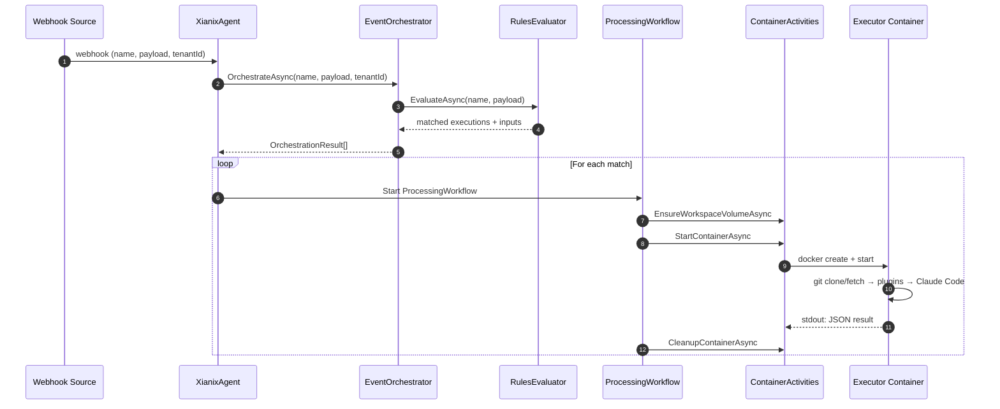

Every webhook event follows the same path through the agent. Understanding this pipeline is essential before extending anything.

## The Pipeline



### Step by Step

1. **Webhook arrives** — GitHub or Azure DevOps fires an event to the Xians platform, which routes it to the registered agent.

2. **`XianixAgent.OnWebhook`** — The integrator workflow handler receives the event and passes it to the `EventOrchestrator`.

3. **`EventOrchestrator`** — Calls `WebhookRulesEvaluator.EvaluateAsync` to match the event against `rules.json` (loaded from Xians Knowledge). Returns a list of `OrchestrationResult` objects — one per matched execution block.

4. **`ProcessingWorkflow`** — For each match, a Temporal workflow is started. It orchestrates the container lifecycle via `ContainerActivities`.

5. **`ContainerActivities`** — Uses `Docker.DotNet` to create a volume, start the executor container with the right env vars, wait for output, and clean up.

6. **Executor container** — Clones/fetches the repo, installs Claude Code plugins, runs the prompt, and writes a JSON result to stdout.

## Rules Evaluation

The `WebhookRulesEvaluator` is the brain of the matching logic. It reads `rules.json` from Xians Knowledge and evaluates each rule set against the incoming webhook.

**Key behavior:**
- The `webhook` field matches the incoming webhook name (case-insensitive)
- First matching rule set in the array wins
- Each rule set can have multiple `executions` blocks — all matching blocks fire
- `match-any` entries are OR'd — at least one must pass
- `use-inputs` extracts values from the payload via JSON paths
- `execute-prompt` supports `{{placeholder}}` interpolation from extracted inputs

The rules evaluator is stateless and has no Temporal dependency, making it straightforward to unit-test.

:::tip
Most agent behavior changes can be made in `rules.json` alone — no code changes needed. See the [Rules Configuration](/agent-configuration/rules/) guide for the full syntax.
:::

## Orchestration

`EventOrchestrator` sits between the webhook handler and the workflow layer. For each matched execution block, it builds an `OrchestrationResult` containing:

- **TenantId** — identifies who triggered the event
- **WebhookName** — the event type (e.g. `github-pr`)
- **Inputs** — extracted payload values (PR number, branch, repo URL, etc.)
- **Execution** — the plugins to install and prompt to run

## Container Lifecycle

Each `ProcessingWorkflow` manages one container from birth to death:

| Step | Activity | What Happens |
|------|----------|-------------|
| 1 | `EnsureWorkspaceVolumeAsync` | Creates (or finds) a Docker volume named `xianix-{tenantId}-{repoHash}` |
| 2 | `StartContainerAsync` | Pulls the executor image, creates the container with env vars and volume mount, starts it |
| 3 | `WaitAndCollectOutputAsync` | Streams stdout/stderr until exit; enforces timeout |
| 4 | `CleanupContainerAsync` | Removes the container (volume persists for next run) |

After collection, `ProcessingWorkflow` parses the executor's JSON stdout for cost/token metrics and reports them to the Xians platform.

## Tenant Isolation

Every execution runs in its own Docker container. This gives you:

- **Filesystem isolation** — each tenant+repo pair gets its own persistent Docker volume
- **Process isolation** — containers can't interact with each other
- **Resource limits** — CPU, memory, and PID limits are enforced per container
- **Credential scoping** — only the relevant platform token is injected

```
┌─────────────────────────────────────────────────┐
│  Host: .NET Agent (Control Plane)                │
│                                                  │
│  ProcessingWorkflow ──── Docker API ────┐        │
├──────────────────────────────────────────┤        │
│  Docker Engine                          │        │
│                                         │        │
│  ┌─ Volume: xianix-tenant-abc-xyz ────┐ │        │
│  │  /workspace/repo/ (bare clone)     │ │        │
│  └──────────┬─────────────────────────┘ │        │
│             │ mounted into              │        │
│  ┌──────────▼─────────────────────────┐ │        │
│  │  Executor Container (ephemeral)    │ │        │
│  │  Non-root user, all caps dropped   │ │        │
│  │  No Docker socket, no host access  │ │        │
│  └────────────────────────────────────┘ │        │
└─────────────────────────────────────────┘        │
```

### Container Security

| Setting | Value |
|---------|-------|
| User | Non-root (`1000:1000`) |
| CapDrop | `ALL` |
| SecurityOpt | `no-new-privileges` |
| PidsLimit | `256` |
| Memory | Configurable via `CONTAINER_MEMORY_MB` |
| Network | Bridge (full outbound, no Docker socket) |

### Volume Persistence

Workspace volumes survive container restarts. On first run, the repo is cloned. Subsequent runs do a fast `git fetch`. This avoids re-cloning large repos on every event.

## Next Step

Learn how the [Executor](/agent-development/executor/) works inside those containers.
