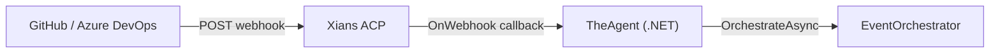
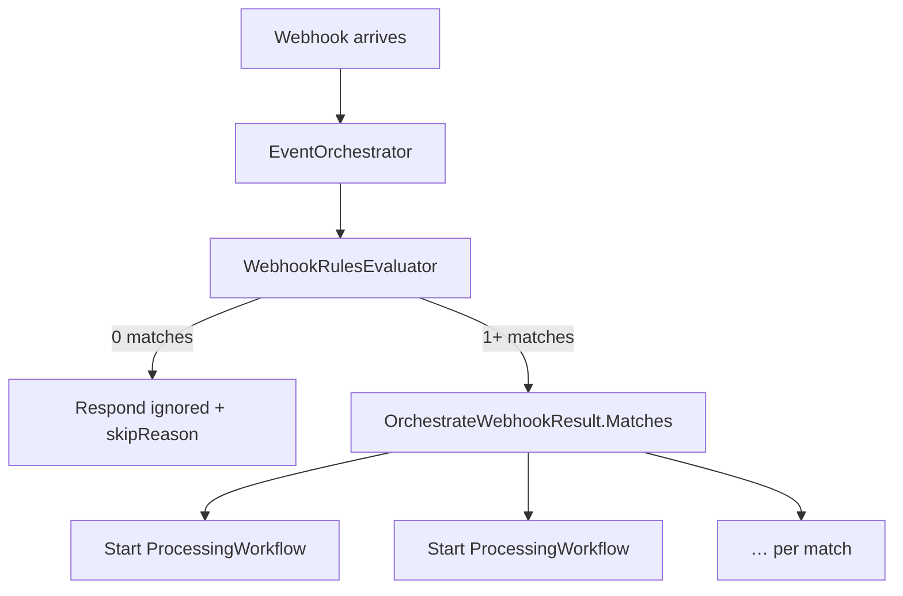
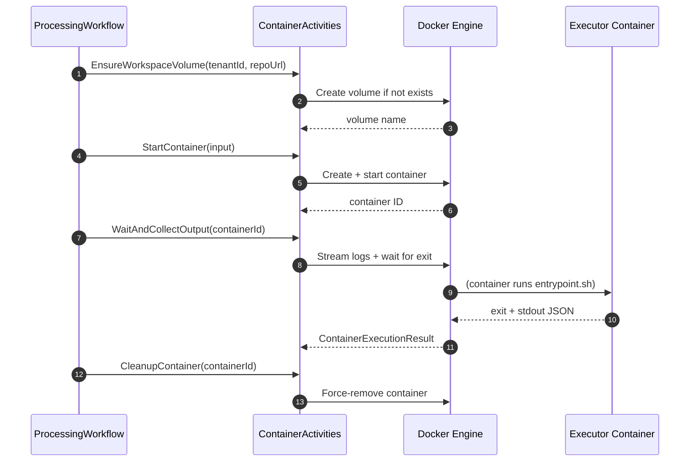
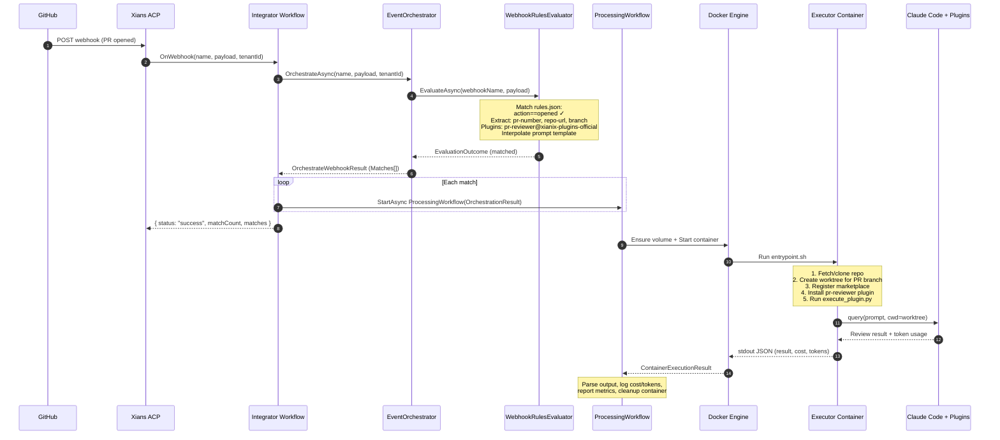
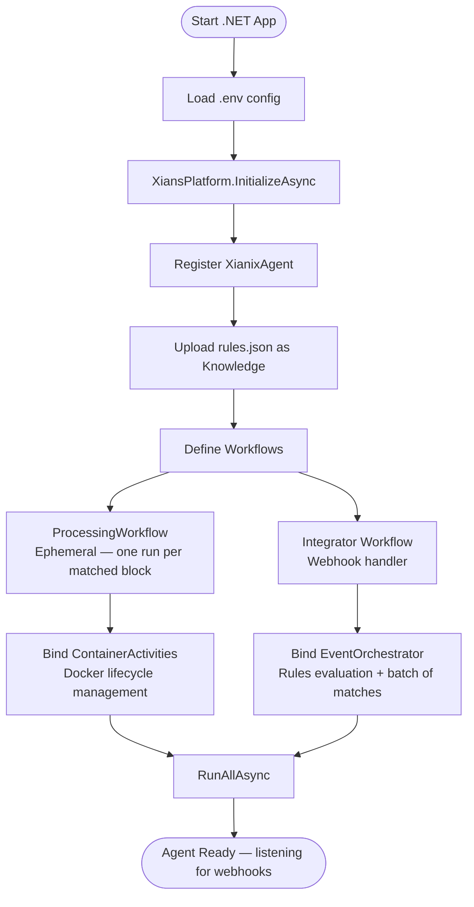
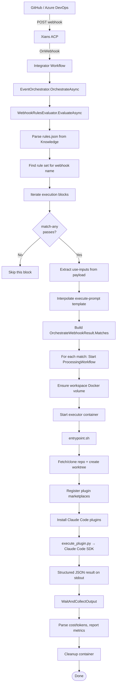

## Architecture objectives

The Xianix Agent is designed around a clear set of principles that guide every technical decision:

- **Sophisticated agent composition** — assemble multi-step, multi-plugin workflows from simple building blocks.
- **Central governance** — run agents on a managed control plane, not scattered across individual developer IDEs.
- **Extensibility through plugins** — drop in custom Claude Code plugins to extend what the agent can do, without modifying the core.
- **Multi-platform support** — work with GitHub, GitLab, and Azure DevOps through a unified abstraction.
- **Security and isolation** — enforce strict boundaries at the tenant and repository level using ephemeral Docker containers.
- **Beyond code** — the same platform supports non-coding agents for marketing, HR, and other enterprise functions.
- **Observability** — built-in monitoring, visibility, and quota allocation across tenants and executions.
- **Human-in-the-loop** — a structured ping-pong between humans and agents, driven by events, so people stay at every decision point.

## How the agent works

The Xianix Agent is a long-running .NET process that turns webhook events from code platforms (GitHub, GitLab, Azure DevOps) into isolated, AI-powered executions. Every execution runs inside an ephemeral Docker container with dynamically installed Claude Code plugins and a fully interpolated prompt — producing outputs such as PR reviews, requirement analyses, or any custom automation you configure.

The system is built around five core concepts that form an end-to-end pipeline:

```
Webhook Event
        │
        ▼
Rule Evaluation
        │
        ▼
Orchestration (batch of matches)
        │
        ▼
Workflow(s): one ProcessingWorkflow per match
        │
        ▼
Docker Execution
        │
        ▼
Prompt Result
```

### 1. Webhook events

Code platforms emit events — a PR is opened, a work item is assigned, a comment is posted. These events arrive as HTTP webhooks at the **Xians ACP** (Agent Control Plane), which routes them to the registered agent.

The agent's **Integrator workflow** receives each webhook and hands it to the **EventOrchestrator**, which determines what — if anything — should happen next.



Every webhook carries a **name** (identifying the webhook channel) and a **JSON payload** (the raw event body from the platform). These two values are the inputs to the rules engine.

### 2. The rules file (`rules.json`)

At startup, the agent uploads `rules.json` as a **knowledge document** to the Xians platform. This file is the declarative brain of the agent — it defines which events to act on, what data to extract, which plugins to install, and what prompt to run.

A `rules.json` file is structured as an array of **webhook rule sets**, each containing one or more **execution blocks**:

```json
[
  {
    "webhook": "Default",
    "executions": [
      {
        "name": "github-pull-request-review",
        "match-any": [ ... ],
        "use-inputs": [ ... ],
        "use-plugins": [ ... ],
        "execute-prompt": "..."
      }
    ]
  }
]
```

Each execution block has four sections:

| Section | Purpose |
|---|---|
| **`match-any`** | A list of filter conditions evaluated against the webhook payload. At least one must pass (OR logic). Each condition uses `==` / `!=` operators on dot-separated JSON paths (e.g. `action==opened`). Supports `&&` (AND) and `\|\|` (OR) within a single rule, wildcard array paths (`resource.reviewers.*.displayName`), and quoted property names for keys with dots (e.g. `"System.AssignedTo"`). |
| **`use-inputs`** | Extracts named values from the payload using JSON paths (e.g. `pull_request.title` → `pr-title`) or sets constant values (e.g. `"platform": "github"`). These inputs become `{{placeholder}}` variables in the prompt template. |
| **`use-plugins`** | Lists Claude Code plugins to install in the executor container. Each entry specifies a `plugin-name` (in `name@marketplace` format), an optional `marketplace` source, and optional `envs` for per-plugin environment variables. |
| **`execute-prompt`** | A prompt template with `{{input-name}}` placeholders that are replaced with resolved input values before execution. This is the instruction sent to Claude Code inside the container. |

When the **WebhookRulesEvaluator** processes an incoming event, it:

1. Finds the rule set matching the webhook name.
2. Iterates each execution block and evaluates its `match-any` conditions against the payload.
3. For matched blocks, resolves all `use-inputs` from the payload (JSON paths or constants).
4. Interpolates the `execute-prompt` template with the resolved input values.
5. Returns the matched execution(s) with their inputs, plugins, and a ready-to-run prompt.

Multiple execution blocks can match a single webhook event — each one becomes an independent **OrchestrationResult** in the batch returned by the **EventOrchestrator**.

### 3. Orchestration and processing workflows

Once the rules engine returns matched executions, the **EventOrchestrator** builds an **OrchestrateWebhookResult**: a list of **OrchestrationResult** entries (one per matched block), each carrying `WebhookName`, `TenantId`, resolved `Inputs`, an optional `ExecutionBlockName`, and an **ExecutionSpec** (plugins + interpolated prompt).

The **Integrator** webhook handler does not queue work through a separate long-lived workflow. Instead, it:

1. Calls `OrchestrateAsync` — if nothing matches, it responds with `status: "ignored"` and a **skip reason**.
2. For each match, starts a **ProcessingWorkflow** run via the Xians workflow API (`StartAsync<ProcessingWorkflow>` with a unique run ID).

So **N** matching blocks from a single webhook produce **N** independent **ProcessingWorkflow** instances, each with its own Temporal history and Docker run.



**ProcessingWorkflow** is a Temporal workflow that executes the full Docker container pipeline for a **single** matched execution block. It runs through a series of Temporal activities: ensure the workspace volume, start the container, wait for output, parse the result, report metrics, and clean up.

### 4. Executor: Docker container isolation

Each execution runs inside an **ephemeral Docker container** (the "Executor") that provides tenant-level isolation. No state persists between executions except the bare git repository stored on a Docker volume.

#### Container lifecycle



The **ContainerActivities** class manages the Docker lifecycle through the Docker API:

1. **EnsureWorkspaceVolume** — creates a deterministic Docker volume (`xianix-{tenantId}-{hash(repoUrl)}`) for the tenant + repo pair. This volume persists a bare clone of the repository across executions, avoiding full re-clones.

2. **StartContainer** — creates and starts the executor container with:
   - The workspace volume mounted at `/workspace/repo`
   - Environment variables: `TENANT_ID`, `EXECUTION_ID`, `XIANIX_INPUTS` (JSON), `CLAUDE_CODE_PLUGINS` (JSON), `PROMPT`, `ANTHROPIC_API_KEY`, platform tokens, and any per-plugin env vars from the rules
   - Resource limits: memory cap, CPU limit, PID limit (256), no-new-privileges security option

3. **WaitAndCollectOutput** — streams container logs and waits for exit (30-minute timeout). Parses the stdout JSON for cost, token usage, and session metadata.

4. **CleanupContainer** — force-removes the container after a 2-minute cooldown. The workspace volume is intentionally kept for reuse.

#### What the executor container does

When the container starts, its `entrypoint.sh` script runs through a deterministic pipeline:

1. **Extract inputs** — reads `XIANIX_INPUTS` JSON to get the repository URL, platform type, and git ref (branch).
2. **Configure git credentials** — sets up token-based authentication for GitHub or Azure DevOps using `git config url.insteadOf`.
3. **Manage the repository** — fetches into the existing bare clone on the volume (or clones fresh on first run), then creates an isolated git worktree for the specific execution and branch.
4. **Install Claude Code plugins** — the dynamic plugin installation step (see next section).
5. **Execute the prompt** — hands off to `execute_plugin.py`, which invokes Claude Code via the SDK.
6. **Clean up** — removes the worktree after execution.

### 5. Dynamic plugin installation

Plugins are the extensibility mechanism of the agent. Rather than baking capabilities into the executor image, plugins are installed at runtime based on what the rules file specifies for each execution.

The `entrypoint.sh` script reads the `CLAUDE_CODE_PLUGINS` JSON array and performs two passes:

**Pass 1 — Register marketplaces:** Each unique marketplace source is registered with `claude plugin marketplace add`. This supports GitHub `owner/repo` shorthands, full git URLs, or remote marketplace manifest URLs. Built-in marketplaces are skipped, and each marketplace is registered only once.

**Pass 2 — Install plugins:** Each plugin is installed with `claude plugin install <plugin-name@marketplace> --scope project`, making its slash commands available to Claude Code for that execution.

For example, given this rule configuration:

```json
{
  "use-plugins": [
    {
      "plugin-name": "pr-reviewer@xianix-plugins-official",
      "marketplace": "xianix-team/plugins-official",
      "envs": [
        { "name": "GITHUB_PERSONAL_ACCESS_TOKEN", "value": "env.GITHUB_TOKEN" }
      ]
    }
  ]
}
```

The executor will:

1. Register the `xianix-team/plugins-official` marketplace.
2. Install the `pr-reviewer` plugin from that marketplace.
3. Inject `GITHUB_PERSONAL_ACCESS_TOKEN` into the container (resolved from the host's `GITHUB_TOKEN`).

Plugin installation failures are non-fatal — the prompt may still succeed with partial tooling.

### 6. Prompt execution

After plugins are installed, `execute_plugin.py` invokes Claude Code using the **Claude Agent SDK**:

```python
options = ClaudeAgentOptions(
    cwd=work_dir,
    permission_mode="bypassPermissions",
)

async for message in query(prompt=prompt, options=options):
    # collect text blocks and tool usage
```

The script:

- Runs in the git worktree directory with full repository context.
- Uses `bypassPermissions` mode since the container is already isolated.
- Streams messages from Claude Code, collecting text output and tool invocations.
- Writes a structured JSON result to stdout with: status, result text, cost, token usage, and session ID.

This JSON output is captured by the **WaitAndCollectOutput** activity back in the .NET process, parsed for metrics, and logged.

### Putting it all together

Here is the complete end-to-end flow, from a PR being opened to a review being posted:



---

## Diagrams

### Agent startup



### Webhook event processing


