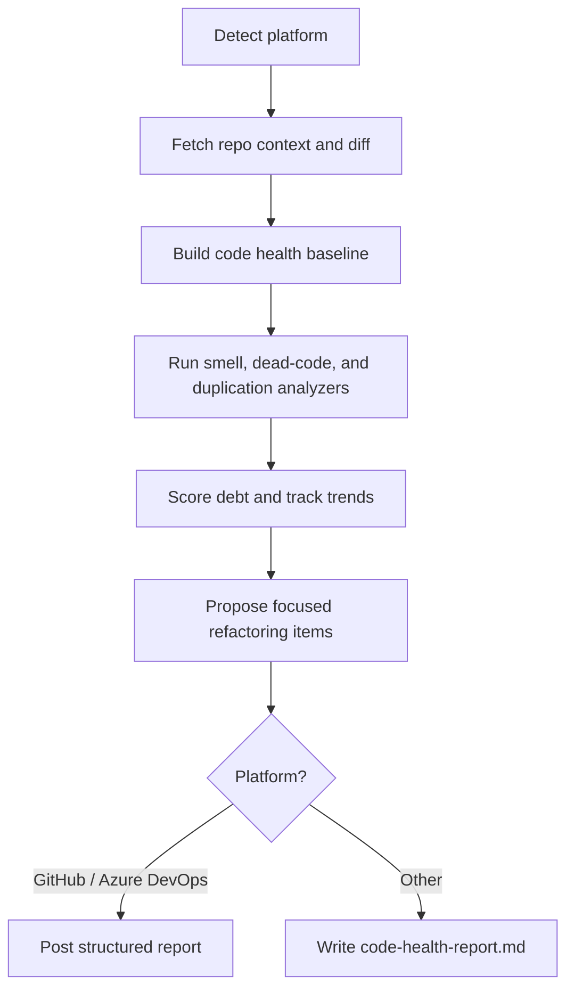

The **Code Health Agent** scans repository changes and baseline code to identify maintainability risks before they compound.

It focuses on:

| Capability | What it detects |
|---|---|
| **Code Smells** | Long methods, large classes, complex conditionals, poor naming, low cohesion |
| **Dead Code** | Unused functions, stale modules, unreachable branches, orphaned assets |
| **Duplicated Logic** | Copy-pasted logic blocks, repeated condition chains, near-duplicate implementations |
| **Technical Debt Tracking** | Debt hotspots by file/area, trend direction, and prioritized refactor candidates |

Works with **GitHub**, **Azure DevOps**, **Bitbucket**, and any generic git repository.

---

## How It Works



1. **Detect platform** — reads `git remote` to identify GitHub, Azure DevOps, Bitbucket, or generic.
2. **Fetch context** — collects changed files, commit history, and language mix for the selected branch or PR.
3. **Analyze health signals** — runs specialized passes for smells, dead code, and duplication.
4. **Track technical debt** — compares current findings with prior runs to show trend and drift.
5. **Prioritize refactors** — emits focused, scoped refactoring items ranked by impact and effort.
6. **Publish report** — posts a single structured summary (or saves to `code-health-report.md` on unsupported platforms).

With the `--fix` flag, the plugin can optionally apply safe cleanup updates and open a patch/commit for review.

---

## Inputs

| Input | Source | Required | Description |
|---|---|---|---|
| Repository URL | Agent rule | Yes | The repository to analyze — provided by the Xianix Agent rule, not typed in the prompt |
| PR number | Prompt | No | Analyze a specific pull request (e.g. `123`) |
| Branch name | Prompt | No | Analyze a branch against the default base |
| Scope path | Prompt | No | Restrict analysis to a directory or file pattern |
| `--fix` flag | Prompt | No | Apply safe refactors for low-risk findings |

The platform is **auto-detected** from `git remote`.

---

## Sample Prompts

**Analyze the current branch:**

```text
/code-health
```

**Analyze a specific PR:**

```text
/code-health 42
```

**Analyze only a specific area:**

```text
/code-health --scope src/services
```

**Analyze and apply safe fixes:**

```text
/code-health 42 --fix
```

---

## Report Output

The generated report includes:

- **Health score** by repository and by touched subsystem
- **Top code smell clusters** with concrete examples
- **Dead code candidates** grouped by confidence
- **Duplication map** highlighting repeated logic groups
- **Technical debt trend** (improving, stable, or degrading)
- **Refactoring backlog** with focused, small-scope action items

Each refactoring recommendation includes:

- why the item matters
- expected maintainability impact
- suggested implementation boundary
- risk notes and validation hints

---

## Environment Variables

| Variable | Platform | Required | Purpose |
|---|---|---|---|
| `GITHUB_TOKEN` | GitHub | Yes | Authenticate `gh` CLI to fetch PR context and publish findings |
| `AZURE_DEVOPS_TOKEN` | Azure DevOps | Yes | PAT for REST API calls and posting analysis results |

### GitHub Token Permissions

The `GITHUB_TOKEN` requires:

| Permission | Access | Why it's needed |
|---|---|---|
| **Contents** | Read | Read repository files, commit history, and branch metadata |
| **Metadata** | Read | Resolve repository and collaborator metadata |
| **Pull requests** | Read & Write | Fetch PR context and post code health findings |

---

## Quick Start

```bash
# Point Claude Code at the plugin
claude --plugin-dir /path/to/xianix-plugins-official/plugins/code-health-agent

# Then in the chat
/code-health
```

Or trigger it automatically via Xianix Agent rules.

---

## Rule Examples

Add one (or both) execution blocks to your `rules.json` so the agent runs when the code health label/tag is present.

### Trigger behavior

The Code Health Agent is **tag-driven** and runs when `ai-dlc/pr/code-health` is present on a pull request and one of these happens:

| Scenario | What it covers |
|---|---|
| Tag newly applied to a PR | Someone adds `ai-dlc/pr/code-health` to an open PR |
| PR opened with tag already present | PR is created with the tag |
| New commits pushed to tagged PR | Branch updates while tag remains |

| Platform | Scenario | Webhook event | Filter rule |
|---|---|---|---|
| GitHub | Tag newly applied | `pull_request` | `action==labeled` and `label.name=='ai-dlc/pr/code-health'` |
| GitHub | PR opened with tag | `pull_request` | `action==opened` and `ai-dlc/pr/code-health` is in `pull_request.labels` |
| GitHub | New commits to tagged PR | `pull_request` | `action==synchronize` and `ai-dlc/pr/code-health` is in `pull_request.labels` |
| Azure DevOps | Tag newly applied | `git.pullrequest.updated` | `message.text` contains `tagged the pull request` and `ai-dlc/pr/code-health` is in `resource.labels` |
| Azure DevOps | PR created with tag | `git.pullrequest.created` | `ai-dlc/pr/code-health` is in `resource.labels` |
| Azure DevOps | New commits to tagged PR | `git.pullrequest.updated` | `message.text` contains `updated the source branch` and `ai-dlc/pr/code-health` is in `resource.labels` |

### GitHub

```json
{
  "name": "github-code-health",
  "match-any": [
    {
      "name": "github-pr-tag-applied",
      "rule": "action==labeled&&label.name=='ai-dlc/pr/code-health'"
    },
    {
      "name": "github-pr-opened-with-tag",
      "rule": "action==opened&&pull_request.labels.*.name=='ai-dlc/pr/code-health'"
    },
    {
      "name": "github-pr-synchronize-with-tag",
      "rule": "action==synchronize&&pull_request.labels.*.name=='ai-dlc/pr/code-health'"
    }
  ],
  "use-inputs": [
    { "name": "pr-number",       "value": "number" },
    { "name": "repository-url",  "value": "repository.clone_url" },
    { "name": "repository-name", "value": "repository.full_name" },
    { "name": "pr-title",        "value": "pull_request.title" },
    { "name": "pr-head-branch",  "value": "pull_request.head.ref" },
    { "name": "platform",        "value": "github", "constant": true }
  ],
  "use-plugins": [
    {
      "plugin-name": "code-health-agent@xianix-plugins-official",
      "marketplace": "xianix-team/plugins-official"
    }
  ],
  "execute-prompt": "You are running a code health analysis for pull request #{{pr-number}} titled \"{{pr-title}}\" in repository {{repository-name}} (branch: {{pr-head-branch}}).\n\nRun /code-health to detect code smells, dead code, duplication, debt trends, and produce focused refactoring items."
}
```

### Azure DevOps

```json
{
  "name": "azuredevops-code-health",
  "match-any": [
    {
      "name": "azuredevops-pr-tag-applied",
      "rule": "eventType==git.pullrequest.updated&&message.text*='tagged the pull request'&&resource.labels.*.name=='ai-dlc/pr/code-health'"
    },
    {
      "name": "azuredevops-pr-created-with-tag",
      "rule": "eventType==git.pullrequest.created&&resource.labels.*.name=='ai-dlc/pr/code-health'"
    },
    {
      "name": "azuredevops-pr-source-branch-updated-with-tag",
      "rule": "eventType==git.pullrequest.updated&&message.text*='updated the source branch'&&resource.labels.*.name=='ai-dlc/pr/code-health'"
    }
  ],
  "use-inputs": [
    { "name": "pr-number",       "value": "resource.pullRequestId" },
    { "name": "repository-url",  "value": "resource.repository.remoteUrl" },
    { "name": "repository-name", "value": "resource.repository.name" },
    { "name": "pr-title",        "value": "resource.title" },
    { "name": "pr-head-branch",  "value": "resource.sourceRefName" },
    { "name": "platform",        "value": "azuredevops", "constant": true }
  ],
  "use-plugins": [
    {
      "plugin-name": "code-health-agent@xianix-plugins-official",
      "marketplace": "xianix-team/plugins-official"
    }
  ],
  "execute-prompt": "You are running a code health analysis for pull request #{{pr-number}} titled \"{{pr-title}}\" in repository {{repository-name}} (branch: {{pr-head-branch}}).\n\nRun /code-health to detect code smells, dead code, duplication, debt trends, and produce focused refactoring items."
}
```

:::note
These blocks belong inside the `executions` array of a rule set. See [Rules Configuration](/agent-configuration/rules/) for full syntax.
:::
