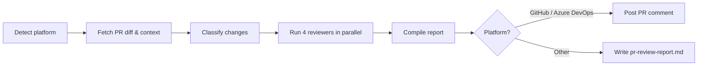

The **PR Reviewer** plugin runs four specialized reviewers in parallel and posts a unified, structured review directly on your pull request.

| Reviewer | What it looks for |
|---|---|
| **Code Quality** | Architecture, patterns, readability, maintainability |
| **Security** | Vulnerabilities, exposed secrets, insecure patterns (OWASP) |
| **Test Coverage** | Missing tests, quality gaps, untested code paths |
| **Performance** | Bottlenecks, algorithmic issues, resource waste |

Works with **GitHub**, **Azure DevOps**, **Bitbucket**, and any generic git repository.

---

## How It Works



1. **Detect platform** — reads `git remote` to identify GitHub, Azure DevOps, Bitbucket, or generic.
2. **Fetch PR context** — gathers the diff, commit log, and changed file list against the base branch.
3. **Classify changes** — determines change type, languages involved, risk level, and scope.
4. **Parallel review** — code-quality, security, test, and performance reviewers run simultaneously.
5. **Compile & post** — findings are merged into a single report and posted as a PR comment (or saved to `pr-review-report.md` for unsupported platforms).

With the `--fix` flag the plugin will also apply fixes, commit, and push.

---

## Inputs

| Input | Source | Required | Description |
|---|---|---|---|
| Repository URL | Agent rule | Yes | The repository to review — provided by the Xianix Agent rule, not typed in the prompt |
| PR number | Prompt | No | Target a specific pull request (e.g. `123`) |
| Branch name | Prompt | No | Compare a branch against the default base |
| `--fix` flag | Prompt | No | Auto-fix issues, commit, and push |

The platform (GitHub, Azure DevOps, etc.) is **auto-detected** from `git remote` — you don't need to specify it.

---

## Sample Prompts

**Review the current branch:**

```text
/pr-review
```

**Review a specific PR:**

```text
/pr-review 42
```

**Review and auto-fix:**

```text
/pr-review 42 --fix
```

---

## Environment Variables

| Variable | Platform | Required | Purpose |
|---|---|---|---|
| `GH_TOKEN` / `GITHUB_TOKEN` | GitHub | Yes | Authenticate `gh` CLI for fetching PR data and posting comments |
| `GIT_TOKEN` | GitHub / Generic | Only with `--fix` | HTTPS push credentials for committing fixes |
| `AZURE_DEVOPS_TOKEN` | Azure DevOps | Yes | PAT for REST API calls and git push |

:::tip
You can export these in your shell or place them in a project-root `.env` file and run `source .env && claude`.
:::

---

## Quick Start

```bash
# Point Claude Code at the plugin
claude --plugin-dir /path/to/xianix-plugins-official/plugins/pr-reviewer

# Then in the chat
/pr-review
```

Or trigger it automatically via the Xianix Agent by adding a `pr-opened` rule — see the [Rules Configuration](/agent-configuration/rules/) guide.
