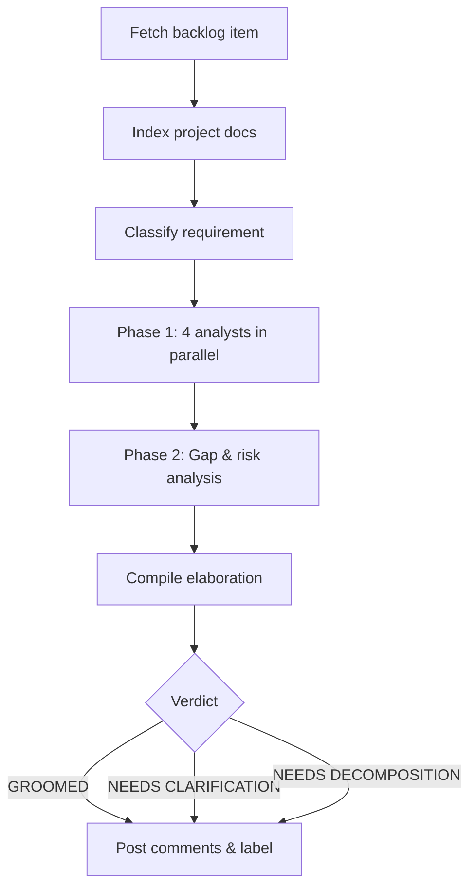

The **Requirement Analyst** plugin grooms backlog items by running five specialized analysts and producing a structured elaboration. It works with **GitHub Issues**, **Azure DevOps Work Items**, or plain text input.

---

## How It Works



1. **Fetch item** — pulls the issue/work-item from GitHub (`gh`) or Azure DevOps (REST API).
2. **Index project context** — scans READMEs, specs, and manifests for a ~500-word project summary.
3. **Classify** — determines type (story / task / bug / spike), domain, and complexity.
4. **Phase 1 (parallel)** — four analysts run simultaneously:
   - **Intent** — what the user really needs and why.
   - **Domain** — relevant domain knowledge, competitive context.
   - **Journey** — maps the user workflow around this requirement.
   - **Persona** — identifies affected user personas.
5. **Phase 2** — a **Gap & Risk** analyst reviews Phase 1 output for missing acceptance criteria, edge cases, and risks.
6. **Compile & post** — findings are formatted and posted as ordered comments on the issue. A verdict label is applied: `GROOMED`, `NEEDS CLARIFICATION`, or `NEEDS DECOMPOSITION`.

For unsupported platforms, the output is written to `requirement-elaboration-report.md`.

---

## Inputs

| Input | Source | Required | Description |
|---|---|---|---|
| Repository URL | Agent rule | Yes | The repository containing the backlog item — provided by the Xianix Agent rule, not typed in the prompt |
| Issue / Work-item number | Prompt | Yes | The backlog item to analyze (e.g. `42`) |

The platform (GitHub, Azure DevOps, etc.) is **auto-detected** from `git remote` — you don't need to specify it.

---

## Sample Prompt

```text
/requirement-analysis 42
```

---

## Environment Variables

| Variable | Platform | Required | Purpose |
|---|---|---|---|
| `GITHUB_TOKEN` | GitHub | Yes | Authenticate `gh` CLI for reading issues and posting comments |
| `AZURE_DEVOPS_TOKEN` | Azure DevOps | Yes | PAT for REST API calls (read work items, post comments) |

:::tip
For CI pipelines, you can also set `PLATFORM`, `REPO_URL`, and `ISSUE_NUMBER` to drive the plugin without interactive input.
:::

---

## Quick Start

```bash
# Point Claude Code at the plugin
claude --plugin-dir /path/to/xianix-plugins-official/plugins/req-analyst

# Then in the chat
/requirement-analysis 42
```

Or trigger it automatically via the Xianix Agent by adding a rule — see the examples below and the [Rules Configuration](/agent-configuration/rules/) guide.

---

## Rule Examples

Add one (or both) of the execution blocks below to your `rules.json` so the Xianix Agent automatically grooms backlog items when a webhook fires.

### When does the agent trigger?

| Platform | Scenario | Webhook event | Filter rule |
|---|---|---|---|
| GitHub | Issue assigned to agent | `issues` | `action==assigned` and `assignee.login` is `xianix-agent` |
| Azure DevOps | Work item assigned to agent in "To Do" state | `workitem.updated` | `System.AssignedTo` changed to `xianix-agent` and state is `To Do` |

### GitHub

```json
{
  "name": "github-issue-requirement-analysis",
  "match-any": [
    {
      "name": "github-issue-assigned-to-agent",
      "rule": "action==assigned&&assignee.login=='xianix-agent'"
    }
  ],
  "use-inputs": [
    { "name": "issue-number",    "value": "issue.number" },
    { "name": "repository-url",  "value": "repository.clone_url" },
    { "name": "repository-name", "value": "repository.full_name" },
    { "name": "issue-title",     "value": "issue.title" },
    { "name": "platform",        "value": "github", "constant": true }
  ],
  "use-plugins": [
    {
      "plugin-name": "req-analyst@xianix-plugins-official",
      "marketplace": "xianix-team/plugins-official"
    }
  ],
  "execute-prompt": "Issue #{{issue-number}} titled \"{{issue-title}}\" in the repository {{repository-name}} has been assigned to xianix-agent for requirement analysis.\n\nRun /requirement-analysis {{issue-number}} to perform the automated requirement analysis and elaboration."
}
```

### Azure DevOps

```json
{
  "name": "azuredevops-work-item-requirement-analysis",
  "match-any": [
    {
      "name": "azuredevops-workitem-assigned-to-agent",
      "rule": "eventType==workitem.updated&&resource.fields.\"System.AssignedTo\".newValue=='xianix-agent <xianix-agent@99x.io>'&&resource.revision.fields.\"System.State\"=='To Do'"
    }
  ],
  "use-inputs": [
    { "name": "workitem-id",     "value": "resource.workItemId" },
    { "name": "workitem-title",  "value": "resource.revision.fields.\"System.Title\"" },
    { "name": "workitem-type",   "value": "resource.revision.fields.\"System.WorkItemType\"" },
    { "name": "project-name",    "value": "resource.revision.fields.\"System.TeamProject\"" },
    { "name": "repository-url",  "value": "https://org@dev.azure.com/org/Project/_git/Repo", "constant": true },
    { "name": "platform",        "value": "azuredevops", "constant": true }
  ],
  "use-plugins": [
    {
      "plugin-name": "req-analyst@xianix-plugins-official",
      "marketplace": "xianix-team/plugins-official"
    }
  ],
  "execute-prompt": "Work item ({{workitem-type}}) #{{workitem-id}} titled \"{{workitem-title}}\" in project {{project-name}} has been assigned to xianix-agent for requirement analysis.\n\nRun /requirement-analysis {{workitem-id}} to perform the automated requirement analysis and elaboration."
}
```

:::note
These blocks go inside the `executions` array of a rule set. See [Rules Configuration](/agent-configuration/rules/) for the full file structure and filter syntax.
:::
